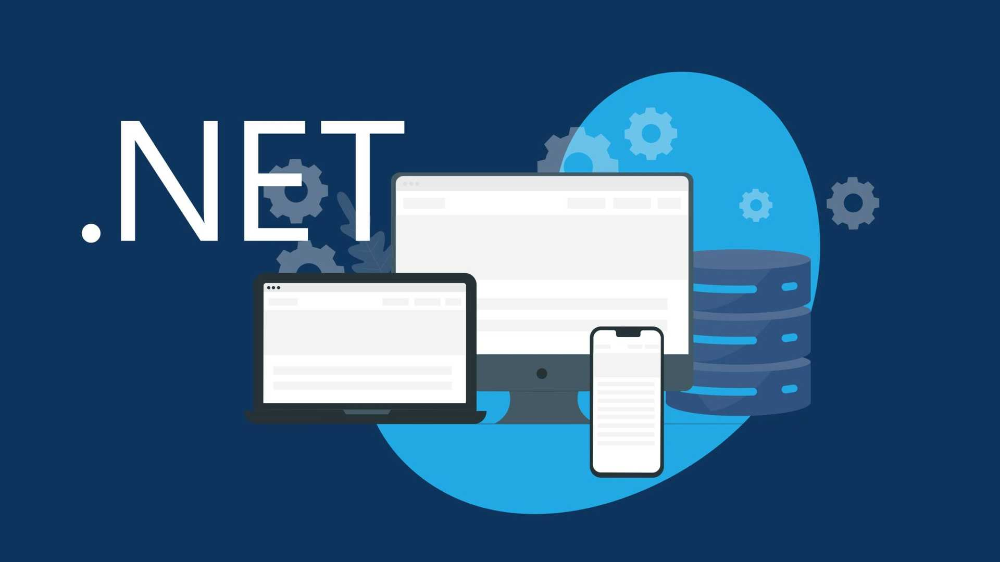

# Bootcamp WEX - End to End Engineering

Este repositório contém materiais para o módulo "Fundamentos .NET".

Estrutura:

- `1-fundamentos-dotnet/`
  - `anotacoes/` - notas curtas sobre conceitos e comandos.
  - `praticas/` - exemplos pequenos e exercícios em C# (projetos console).
  - `projeto-portfolio/` - exemplo de aplicação ASP.NET Core (minimal API) para um portfolio.

Como usar:

1. Instale o .NET SDK (versão 8.0 ou compatível): https://dotnet.microsoft.com
2. Para cada projeto navegue até a pasta e execute `dotnet run`.

Exemplo:

```bash
cd 1-fundamentos-dotnet/praticas/hello-world
dotnet run
```

Se quiser executar a API do portfolio:

```bash
cd 1-fundamentos-dotnet/projeto-portfolio
dotnet run
# depois abrir http://localhost:5041/portfolio
```
# bootcamp-wex-end-to-end-engineering
Repositório principal de estudos e projetos do Bootcamp WEX - End to End Engineering (DIO). Conteúdo organizado por módulos, incluindo C#, .NET, POO, SQL Server, Docker, Kubernetes e AWS.<br>meu novo projetos disso 

<br>my learning now 